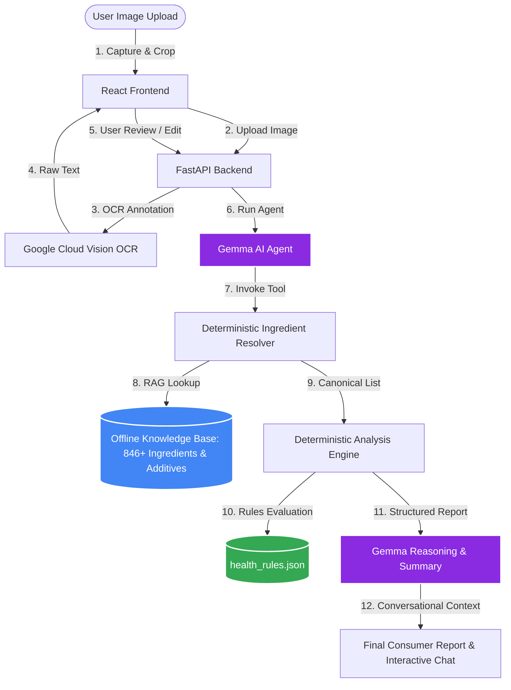

# 🛡️ Care — Intelligent Ingredient Understanding Platform

[](https://ai.google.dev/gemma)
[](https://fastapi.tiangolo.com)
[](https://react.dev)
[](https://tailwindcss.com)
[](https://opensource.org/licenses/MIT)

Care is a next-generation, AI-first ingredient analysis platform that deciphers packaged food labels for everyday consumers. By fusing **deterministic mathematical systems** with the advanced **cognitive reasoning of Google Gemma**, Care translates complex chemical lists, INS numbers, and marketing jargon into clear, grounded, and actionable health reports.

---

## 📖 The Care Story: Deterministic Safety Meets AI Reasoning

Packaged food labels are deliberately complex. Manufacturers hide hydrogenated oils, chemical stabilizers, and high-fructose corn syrups behind obscure technical names and international numbering systems (INS). Traditional apps attempt to solve this with simple word-matching or raw database queries, which fail when encountering OCR noise, synonyms, or complex multi-ingredient contexts.

Care introduces a novel hybrid architecture where **Google Gemma is the hero and intelligence layer**. Rather than treating the LLM as a black-box generator that guesses health scores (leading to hallucinations), Care runs a strict one-directional pipeline:



In this architecture, **Gemma acts as the central orchestration engine**. Gemma does not calculate safety scores or categorize additives. Instead, it reads the structured report built by the deterministic engine and utilizes its linguistic intelligence to write a highly empathetic, consumer-friendly narrative, explain the physiological impact of identified concerns, and recommend wholesome alternatives.

---

## 🧠 Core AI & Gemma-Driven Architecture

### 1. Gemma Function Calling & Grounded Action
Gemma is integrated using a strict **Function Calling paradigm**. Instead of answering user queries in isolation—which risks model drift and hallucinations—Gemma initiates backend tool calls to resolve raw texts and query the deterministic rule engine. 
* **Grounded Responses**: Every claim Gemma makes is anchored in the structured schema return of the tool execution. If Gemma discusses a hazard associated with *Sodium Benzoate (INS 211)*, it does so because the database returned that specific additive record, keeping the conversation 100% grounded.
* **Separation of Concerns**: The LLM is restricted from making raw scoring decisions. If the engine rules determine a score of `45/100`, Gemma cannot alter it; it explains *why* the score is 45 based on the category penalties applied.

### 2. Retrieval-Augmented Generation (RAG) over Curated Knowledge
Rather than relying purely on pre-trained weights, Gemma reasons over a high-fidelity, offline-compiled knowledge base. The retrieval pipeline runs entirely locally, ensuring privacy and sub-second response times:
* **Ingredient Knowledge Base**: Over 840+ canonical food ingredients compiled directly from Open Food Facts taxonomies, complete with common aliases, processing identifiers, and category maps.
* **Food Additive Database**: A complete index of food preservatives, emulsifiers, artificial colorings, and sweeteners mapped by INS/E numbers, complete with safety risk classifications (Low, Moderate, High) and physiological concern descriptions.
* **Offline Retrieval**: The backend resolver performs multi-stage matching (Exact, Alias, Fuzzy, and Token-based Partial overlap) against local datasets, compiling a dense context package for Gemma's prompt window.

### 3. Intelligent OCR Enhancement
Label photos taken in supermarket aisles suffer from glare, cylindrical curvature, folds, and low resolution. Care's ingestion pipeline handles these imperfections intelligently:
1. **Raw Extraction**: The platform leverages Google Cloud Vision to extract raw text blocks.
2. **Text Normalization**: Noise is scrubbed, and punctuation is normalized.
3. **Structured Context Resolution**: Gemma evaluates parsed elements within their textual context, identifying when words are split across lines or misspelled due to OCR character confusion, and resolves them to their correct canonical structures.

### 4. Deep Cognitive Ingredient Understanding
Traditional matching engines fail when encountering complex label declarations (e.g., *"organic cold-pressed expeller-extracted sunflower seed oil"* vs *"sunflower oil"*). Gemma interprets the semantic context:
* **Purpose & Context**: Gemma understands that "sunflower oil" is a carrier fat, while "hydrogenated cottonseed oil" is a processing marker indicating trans fats.
* **Processing Classification**: Gemma categorizes ingredients based on processing levels, distinguishing whole foods from ultra-processed isolates.

### 5. Consumer-Friendly Explanations
Scientific terminology is translated into clear, everyday language:
> **Report Fact**: *"Contains INS 451(i) (Pentasodium triphosphate) with a high risk penalty."*  
> **Gemma Explanation**: *"This product contains added phosphates, which are mineral salts used to retain moisture. High consumption of added phosphates is linked to kidney stress and cardiovascular concerns, so it's best to enjoy this product in moderation."*

### 6. Context-Aware AI Recommendations
Instead of recommending generic, static alternatives, Gemma evaluates the analyzed product's profile to generate personalized suggestions:
* If the product is high in refined flour, Gemma recommends slow-digesting whole-grain swaps.
* If high-risk chemical preservatives are present, Gemma suggests organic, clean-label alternatives.
* All suggestions are directly linked to high-quality marketplaces, starting with **FirstClub**, via a pluggable marketplace abstraction layer.

---

## ⚖️ Design Philosophy: The Trustworthy AI Quadrant

Care is built on the belief that modern consumer AI must be **verifiable, deterministic, and empathetic**. We combine these traits into four distinct pillars:

| Pillar | Sub-system | Core Responsibility | Why It Matters |
| :--- | :--- | :--- | :--- |
| **Correctness** | Deterministic Engine | Evaluates static JSON rules, applies category penalties/bonuses, and computes scores. | Guarantees that identical ingredient lists always produce the identical health scores. Zero variance. |
| **Reasoning** | Google Gemma | Translates structured JSON facts into warm, consumer-ready copy and manages conversational state. | Replaces cold, robotic statistical reports with friendly, conversational, and personalized advice. |
| **Grounding** | Local RAG Pipeline | Resolves OCR text against 846+ canonical ingredients and maps INS codes to known risk levels. | Prevents LLM hallucinations. Gemma is strictly forbidden from inventing ingredient facts. |
| **Orchestration** | Function Calling Interface | Coordinates boundaries between the UI, OCR parser, Resolver, and Rule Engine. | Keeps the AI pipeline modular, testable, and aligned with standard software contracts. |

---

## ✨ Features

- **✓ Gemma-Powered Agent Orchestration**: Multi-turn conversation allows users to ask questions about the analyzed product ("Is this safe for kids?", "Why is the score poor?").
- **✓ Grounded RAG Ingestion**: Offline-generated dictionary matches 846 canonical ingredients covering ~94.5% of ingredient occurrences.
- **✓ Deterministic Health Rule Engine**: Calculates Health Score (0-100), Processing Level (Minimally Processed, Processed, Highly Processed, Ultra-Processed), Allergens, and Positives.
- **✓ Intelligent OCR & Crop UI**: Mobile-first frontend allows users to photograph, crop, review, and edit OCR text before submitting it for analysis.
- **✓ Contextual Recommendation Engine**: Generates healthier alternatives based on the specific negative attributes flagged in the health report.
- **✓ Pluggable Marketplace Integration**: Dynamic alternative recommendations with direct purchase links to premium healthy marketplaces (e.g., FirstClub).

---

## 🛠️ Tech Stack

### Backend
| Technology | Role | Rationale |
| :--- | :--- | :--- |
| **FastAPI** | Core API Web Framework | High-performance, asynchronous endpoints, auto-generated OpenAPI documentation. |
| **Google Generative AI SDK** | Gemma Client Interface | Handles connections to Google Generative AI endpoints with automatic model fallback. |
| **Pydantic v2** | Data Validation & Schemas | Enforces rigid input/output contracts between pipeline stages. |
| **Python 3.11+** | Language Runtime | Robust data science ecosystem and strong async support. |

### Frontend
| Technology | Role | Rationale |
| :--- | :--- | :--- |
| **React + TypeScript** | Client Interface | Type-safe, component-driven, highly responsive mobile-first SPA. |
| **Vite** | Build Tooling | Lightning-fast development server and optimized production bundles. |
| **Tailwind CSS v4** | UI Styling | Modern, utility-first styling with hardware-accelerated design tokens. |
| **Framer Motion** | Micro-animations | Smooth transitions, scanlines, and fluid layout morphing. |
| **Lucide React** | Icon Pack | Consistent, clean SVG iconography across the interface. |

---

## 📁 Repository Structure

```
Care/
├── backend/
│   ├── api/                   # FastAPI routing and controller logic
│   │   ├── dependencies.py    # Service and repository injection providers
│   │   ├── errors.py          # Global exception handlers & mapping
│   │   └── routes/            # Route controllers (ocr, analyze, gemma)
│   ├── config.py              # Environment configuration & Settings schema
│   ├── data/                  # Local knowledge bases (additives, health rules)
│   │   ├── food_additives.json# 30KB+ mapped additives index with safety metrics
│   │   └── health_rules.json  # Health rules, bonuses, penalties, and thresholds
│   ├── models/                # Typed Pydantic models (contracts between services)
│   │   ├── additives.py       # Additive risk schemas
│   │   ├── health.py          # Health report schemas
│   │   ├── ingredients.py     # Ingredient matching schemas
│   │   └── ocr.py             # OCR result transport models
│   ├── repositories/          # Data Access Layer abstracting JSON data sources
│   │   ├── base.py            # Abstract repository definitions
│   │   ├── json_additive_repository.py
│   │   ├── json_ingredient_repository.py
│   │   └── json_rules_repository.py
│   ├── services/              # Pure business logic implementation
│   │   ├── health_engine/     # Rule evaluation & scoring engine
│   │   ├── llm/               # Gemma integrations & system prompts
│   │   ├── ocr/               # Cloud OCR wrappers
│   │   └── resolver/          # Semantic ingredient matching and parser
│   ├── main.py                # FastAPI ASGI application entrypoint
│   └── requirements.txt       # Python backend dependencies
├── frontend/
│   ├── src/
│   │   ├── api/               # API clients connecting frontend to backend
│   │   ├── components/        # Isolated UI components (cropper, chats, reports)
│   │   ├── types/             # Shared TypeScript type definitions
│   │   ├── App.tsx            # Stage orchestrator & central state manager
│   │   ├── main.tsx           # React bootstrap entrypoint
│   │   └── styles.css         # Tailwind v4 directives & custom themes
│   ├── package.json           # Frontend scripts and npm modules
│   └── tsconfig.json          # TypeScript compilation configuration
├── build_ingredient_dataset.py# Offline tool compiling taxonomy from OFF
├── common_ingredients.json    # Mapped database of 846 canonical ingredients
└── CLAUDE.md                  # Master project engineering specification
```

---

## 🚀 Installation & Local Setup

### Prerequisites
- **Python 3.11+** installed.
- **Node.js 18+** & **npm** installed.
- **Google Cloud Vision API Key** (optional, fallback offline mockup active if unset).
- **Google AI Studio API Key** (for Gemma access).

### 1. Backend Setup
1. Navigate to the backend directory:
   ```bash
   cd backend
   ```
2. Create and activate a virtual environment:
   ```bash
   python -m venv .venv
   # On Windows (PowerShell):
   .venv\Scripts\Activate.ps1
   # On macOS/Linux:
   source .venv/bin/activate
   ```
3. Install dependencies:
   ```bash
   pip install -r requirements.txt
   ```
4. Configure your environment variables. Copy `.env.example` to `.env`:
   ```bash
   copy .env.example .env
   ```
5. Edit `.env` and fill in your keys:
   ```env
   GEMINI_API_KEY=your-google-ai-studio-key
   GOOGLE_VISION_API_KEY=your-google-cloud-vision-api-key
   GEMMA_MODEL_NAME=models/gemma-4-31b-it
   ```
6. Start the development server:
   ```bash
   uvicorn backend.main:app --reload
   ```
   The backend will be running at `http://localhost:8000`.

### 2. Frontend Setup
1. Navigate to the frontend directory:
   ```bash
   cd ../frontend
   ```
2. Install the node dependencies:
   ```bash
   npm install
   ```
3. Set the API environment variables. Copy `.env.example` to `.env` (configured to point to `http://localhost:8000` by default):
   ```bash
   copy .env.example .env
   ```
4. Run the Vite development server:
   ```bash
   npm run dev
   ```
   Open `http://localhost:5173` in your browser.

---

## 📡 API Reference

### 1. Optical Character Recognition
`POST /api/v1/ocr`  
Extracts raw ingredient text from a uploaded image payload.

* **Request**: `multipart/form-data` containing `image` (binary).
* **Response**:
  ```json
  {
    "text": "INGREDIENTS: Wheat Flour, Sugar, Palm Oil, Cocoa Powder (3%), Raising Agents (INS 503ii, INS 500ii), Salt, Emulsifier (Soy Lecithin).",
    "confidence": 0.985
  }
  ```

### 2. Full Deterministic Analysis
`POST /api/v1/analyze`  
Processes clean ingredient list, resolves ingredients, scores them, and generates the raw reports.

* **Request Body**:
  ```json
  {
    "ingredient_text": "Wheat Flour, Sugar, Palm Oil, Cocoa Powder, Salt, Soy Lecithin"
  }
  ```
* **Response**:
  ```json
  {
    "report": {
      "health_score": { "score": 68, "label": "Good", "color": "#4285F4" },
      "processing_level": {
        "id": "processed",
        "label": "Processed",
        "description": "Contains some processed ingredients or a few additives.",
        "color": "#FBBC04"
      },
      "positive_ingredients": [
        { "name": "Cocoa Powder", "benefit": "Natural source of vitamins, antioxidants, and fiber" }
      ],
      "ingredients_of_concern": [
        { "name": "Sugar", "concern": "High glycemic index, risk of weight gain", "severity": "moderate" }
      ],
      "health_considerations": [],
      "allergens": [
        { "name": "Gluten", "triggered_by": ["Wheat Flour"] },
        { "name": "Soy", "triggered_by": ["Soy Lecithin"] }
      ],
      "recommended_alternatives": [
        {
          "name": "Dry-Roasted Whole Almonds, Walnuts & Chia Seeds",
          "category": "Healthy Fats Swap",
          "reason": "Rich in Omega-3 fatty acids, zero palm oil, and zero trans fats.",
          "estimated_score": 92,
          "url": "https://www.firstclub.site/"
        }
      ],
      "unresolved_ingredients": [],
      "unresolved_heuristics": []
    },
    "ai_summary": "This product has a good health score of 68/100 and is classified as processed. It benefits from antioxidants in Cocoa Powder, but contains sugar, which should be consumed mindfully. Warning: contains Gluten and Soy allergens."
  }
  ```

### 3. Gemma Report Explanation
`POST /api/v1/gemma/explain`  
Generates a human-friendly narrative summary of an existing analysis.

* **Request Body**:
  ```json
  {
    "ingredient_text": "Wheat Flour, Sugar, Palm Oil, Cocoa Powder, Salt, Soy Lecithin"
  }
  ```
* **Response**:
  ```json
  {
    "summary": "Hi there! Care analyzed this product and rated it as 'Good' with a score of 68/100. It is classified as moderately processed. On the positive side, it features Cocoa Powder, which provides natural antioxidants. However, be mindful that it contains Sugar and Palm Oil, which are ingredients of moderate concern. If you have allergies, please note it contains Gluten and Soy."
  }
  ```

### 4. Interactive Gemma Chat
`POST /api/v1/gemma/chat`  
Answers user questions in real-time regarding the analyzed product context.

* **Request Body**:
  ```json
  {
    "ingredient_text": "Wheat Flour, Sugar, Palm Oil, Cocoa Powder, Salt, Soy Lecithin",
    "messages": [
      { "role": "user", "content": "What is the source of palm oil concern?" }
    ],
    "new_message": "Is it okay if I'm trying to lose weight?"
  }
  ```
* **Response**:
  ```json
  {
    "reply": "If you are trying to lose weight, this product is not ideal. It contains added Sugar and Palm Oil, which are calorically dense and linked to weight gain if consumed frequently."
  }
  ```

---

## 📸 Interface Screenshots & Flows

Below is the user flow designed for point-of-purchase consumer interactions:

| 1. Capture & Crop | 2. OCR Text Review |
| :---: | :---: |
| *[Screenshot Placeholder: Camera Capture & Cropping Window]* | *[Screenshot Placeholder: Editable Extracted Ingredient List]* |
| Align the ingredient label inside the frame, crop out packaging designs, and upload. | Review the text extracted by Cloud Vision. Edit any typo before submitting. |

| 3. Structured Analysis | 4. Chat with Gemma |
| :---: | :---: |
| *[Screenshot Placeholder: Score Meter & Mapped Additive Risks]* | *[Screenshot Placeholder: Gemma Assistant Chat Interface]* |
| View the 0-100 Score, Processing Level, allergens, and alternative FirstClub links. | Ask Gemma detailed questions. Gemma's response stays strict to engine facts. |

---

## 📄 License
This project is licensed under the MIT License - see the [LICENSE](LICENSE) file for details.
